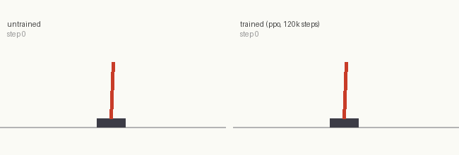
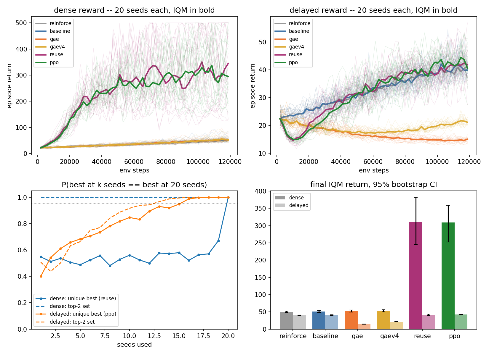

# napkin-returns

Repo 1 of the **[napkin-gamemaster series](https://github.com/arose26/napkin-gamemaster)** (series home and index) — five one-file experiments building to real Atari Pong on a 6GB laptop. This one starts at the bottom.

The policy-gradient ladder — REINFORCE → +baseline → +GAE → +PPO — trained as **one PyTorch file** on CartPole, in minutes, to answer the two questions every RL course skips:

> **Which rung of the ladder actually does the lifting — and how many seeds do you need before the ranking you'd publish is even real?**



This is repo 1 of the **[napkin-gamemaster series](https://github.com/arose26/napkin-gamemaster)**: five small experiments building up to a model that plays a real game on a 6GB laptop GPU (the series home has the full index). This one establishes the on-policy algorithms and — more importantly — the evaluation discipline the rest of the series inherits.

## The experiment

The ladder is three config flags on one shared implementation, so each rung changes exactly one thing:

| rung | baseline | λ | epochs/batch | clip | what's new |
|---|---|---|---|---|---|
| `reinforce` | – | 1.0 | 1 | – | MC return-to-go |
| `baseline` | learned V(s) | 1.0 | 1 | – | state-dependent baseline |
| `gae` | learned V(s) | 0.95 | 1 | – | bootstrapped advantages |
| `reuse` | learned V(s) | 0.95 | 4 | – | data reuse, **no** trust region |
| `ppo` | learned V(s) | 0.95 | 4 | 0.2 | the clip itself |

The `reuse` rung exists because "PPO" bundles two ideas — reusing each batch for 4 epochs, and clipping the ratio so the reuse can't run away. Benchmarking them as one rung would leave the question "was it the trust region, or just more gradient steps?" unanswered.

Crossed with two reward regimes on **identical physics**: CartPole-v1 as-is (dense, +1 per step), and a delayed wrapper paying the entire return at the final step — so credit assignment has something to fail at. **20 seeds per cell**, matched env steps (120k), matched networks, optimizers, batch sizes.

Aggregation is IQM (interquartile mean) with 95% bootstrap CIs, hand-rolled in ~20 lines.

### Design choices stated up front

- **Advantages are batch-normalized in all four methods, including REINFORCE.** Without it, no shared learning rate is fair — MC returns are ~100× the scale of GAE advantages. This hands REINFORCE the cheapest possible baseline (a batch constant) for free, so the `+baseline` rung measures what a *state-dependent* value function adds beyond that. That is the honest version of the question.
- **No entropy bonus, no gradient clipping anywhere.** Extra rungs would blur these four.
- Value-less methods bootstrap 0 at horizon cuts and truncations — there is no V to bootstrap with. That bias is part of what "no critic" costs, not a confound.

## Hypothesis (written before the sweep finished)

1. On **dense** reward, `+baseline` is the biggest single rung; PPO adds a modest final step.
2. On **delayed** reward, the middle of the ladder compresses — a value net struggles to predict a terminal lump, so `baseline` and `gae` buy little — and PPO's extra epochs per batch dominate.
3. The 20-seed ranking is recoverable from ~5 seeds on dense, ~10 on delayed.

The `reuse` arm was added *after* the first four-method sweep (the first results demanded it — see Results), so its prediction is registered separately, again before its runs finished: unclipped reuse captures most of PPO's dense-reward gain but with visibly higher seed variance, and on delayed reward it beats `gae` because four value epochs per batch fix the bootstrap faster.

The `gaev4` arm (GAE with 4 *value* epochs, still 1 policy epoch) was added after `reuse`'s numbers landed, to split *its* bundle: `reuse` reuses the batch for both networks, so it can't say which half rescues the delayed-reward collapse. Registered prediction: `gaev4` recovers most of the collapse (close to `reuse`'s score) and changes nothing on dense.

## Results

Final IQM return over the last 10% of training, 95% bootstrap CI, 20 seeds per cell, 120k env steps each. Bold marks the best per column; CartPole's max is 500.

| rung | dense | delayed |
|---|---|---|
| `reinforce` | 50.3 [48.4, 52.3] | 40.0 [39.1, 41.1] |
| `baseline` | 51.0 [48.6, 54.4] | 40.6 [39.8, 41.5] |
| `gae` | 52.0 [49.7, 55.0] | 14.8 [14.4, 15.1] |
| `gaev4` | 53.1 [50.5, 56.3] | 21.2 [20.8, 21.5] |
| `reuse` | **310.7** [245.7, 381.9] | 41.6 [40.3, 43.5] |
| `ppo` | 309.4 [252.7, 359.1] | **42.7** [41.7, 43.7] |



Reading it:

- **The famous rungs did nothing; the boring one did everything.** On dense reward, a learned baseline and GAE together buy less than 2 points over REINFORCE at matched env steps (50.3 → 52.0, overlapping CIs). Reusing each batch for 4 epochs buys **6×**. The variance-reduction story that dominates textbook treatments of policy gradients is, at this scale and matched steps, nearly invisible next to "take more gradient steps on the data you already paid for".
- **The clip bought nothing measurable — anywhere.** Unclipped `reuse` matches `ppo` on dense (310.7 vs 309.4) and on delayed (41.6 vs 42.7), CIs overlapping in both. At 4 epochs and these learning rates, the trust region is insurance that happened never to pay out, not a performance ingredient. (At more epochs or higher lr, this would presumably stop being true — that's the insurance's actual job.)
- **GAE under delayed reward is worse than no critic at all.** 14.8 against REINFORCE's 40.0 — and the curve *falls* over training. Mechanism: with the entire return paid at the terminal step, the λ=0.95 eligibility attenuates that lump's credit to an action k steps earlier by (γλ)^k ≈ 0.94^k, so early actions see near-pure-noise advantages unless V is already accurate — which early in training it never is. Batch normalization then rescales that noise to unit size and the policy random-walks away from its initialization.
- **And you cannot fix it by fitting V harder — our registered prediction was wrong.** `gaev4` (4 value epochs, 1 policy epoch) recovers only 14.8 → 21.2; full `reuse` recovers 41.6. Most of the rescue lives on the policy side of the reuse, not the value side. We predicted the opposite.
- **On hard credit assignment, the whole ladder is worth 7%.** Delayed reward: REINFORCE 40.0, the best method 42.7. Every intermediate rung is a rounding error or a regression. If your reward is a single terminal lump, algorithm choice within this family is not where the leverage is.

Scoring the hypotheses: #1 wrong (the baseline rung bought ~nothing), #2 half-right (the ladder does compress on delayed reward — but GAE didn't "buy little", it actively collapsed), #3 wrong in the most instructive way (below). The `reuse` prediction was half-right (it captures *all* of PPO's gain, but its seed variance is not visibly higher), and the `gaev4` prediction was wrong outright.

## The seed question

For each k, draw 1000 random k-subsets of the 20 seeds and ask how often the winner at k seeds is the winner at 20 (the k=20 point is 1.0 by construction — there is only one 20-subset).

- **Dense: P(best@k) hovers near 0.5 at every k < 20.** Not because 20 seeds are too few, but because `reuse` and `ppo` are genuinely tied — "the best method" does not exist, and no seed budget will manufacture one. The top-2 *set* is identified correctly from **one seed** (P = 1.00 at k=1).
- **Delayed: the unique best needs ~15 seeds** to be named reliably (P ≥ 0.95); a 1-seed comparison picks the wrong winner 60% of the time.

The standing rule this buys the rest of the series: **report the object that is actually stable** — a set, or a tie — and treat any close single-winner claim under 15 seeds as a hypothesis, not a result.

## Run it

```bash
pip install --target .deps "numpy<2" gymnasium
PYTHONPATH=.deps python3.10 napkin_returns.py selfcheck   # ~1 min, asserts everything below
PYTHONPATH=.deps python3.10 napkin_returns.py sweep       # 2 envs x 5 methods x 20 seeds, ~30 min CPU
PYTHONPATH=.deps python3.10 napkin_returns.py plot        # IQM curves, CIs, ranking stability
PYTHONPATH=.deps python3.10 napkin_returns.py gif         # untrained vs trained, ~1 min
```

Everything lands in `out/` (gitignored); the committed copies of the chart, gif and raw numbers are in `assets/`.

`selfcheck` is not decoration. It asserts, numerically:

- GAE(λ=1, V=0) ≡ MC discounted return-to-go, against an independently written forward recursion;
- GAE(λ=0) ≡ the one-step TD residual;
- truncation bootstraps V(final obs) while termination bootstraps 0;
- **PPO's surrogate at clip=∞, 1 epoch has the *same gradient* as vanilla PG** — so the two ends of the ladder are provably the same method until clipping and reuse turn on;
- the delayed wrapper conserves the episode total and pays it only at the end;
- rollouts are seed-deterministic;
- all four methods solve a 2-armed bandit end-to-end.

## What's deliberately not here

No parallel-env library, no Tensorboard, no config system, no entropy bonus, no observation normalization, no rliable dependency (IQM and bootstrap are ~20 lines). CPU only — the networks are 2×64 MLPs and the GPU would spend longer on transfers than on math.

## Model

Policy and value: separate MLPs, 4→64→64→{2,1}, tanh. Adam, lr 3e-4 (policy) / 1e-3 (value), γ=0.99, λ=0.95, 8 envs × 256-step horizon = 2048 steps per update, PPO: clip 0.2, 4 epochs, minibatch 512. 120k env steps per run; a run takes 6–9 s CPU.
